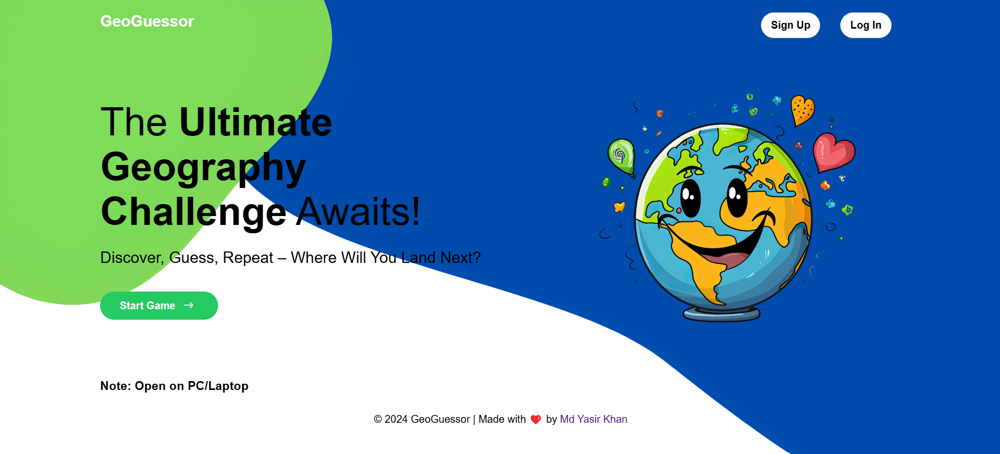
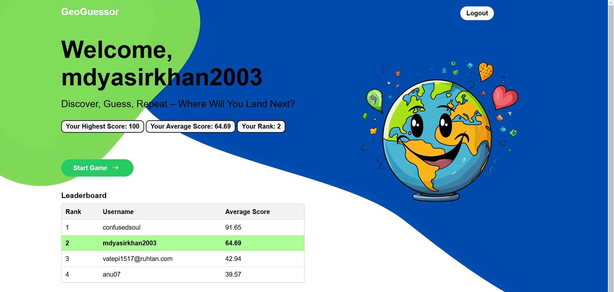
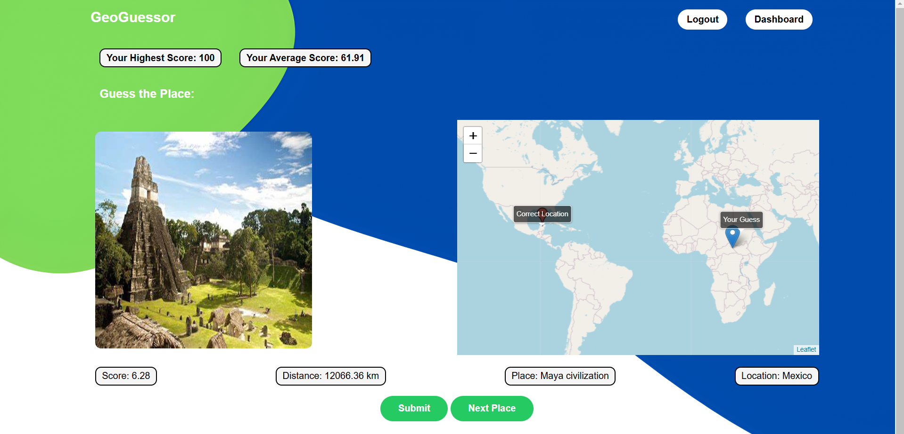

# GeoGuessor 🌍

GeoGuessor is an interactive web game that challenges users to guess locations on a world map. Using Firebase for user authentication and data storage, players can track their high scores, view their ranks on the leaderboard, and explore a variety of locations. The goal is to identify a place by analyzing the images and clues given, then mark your guess on the map. The closer you are, the higher you score!

[GeoGuessor | Try Out Now !!](https://geoguessor.onrender.com/)
---

 <!-- Replace with an actual image path -->

---

## Table of Contents

1. Game Rules
2. Features
3. Screenshots
4. Getting Started
5. Firebase Setup
6. Running the App
7. Tech Stack
8. Future Enhancements
9. Contributing

---

## Game Rules 📜

1. **Objective**: The aim of the game is to guess the location based on an image provided.
2. **Guess the Location**: Players select a spot on the map that they believe matches the image shown.
3. **Scoring**:
   - The score is calculated based on the distance between the guessed location and the actual location.
   - The closer your guess, the higher your score (max score is 100).
4. **Leaderboard**: Compete with other players! See your rank based on average scores.
5. **High Scores**: Track your personal best and average scores across all your games.

---

## Features ✨

- **User Authentication**: Secure signup and login using Firebase Authentication.
- **Leaderboard**: A global leaderboard to track the top players.
- **Score Calculation**: Uses the Haversine formula to calculate distance-based scores.
- **Location-based Gameplay**: Randomly selects unique places from a dataset for each session.
- **Session Management**: Keeps track of user scores, high scores, and gameplay details.
- **Interactive Map**: Integrated with [Leaflet.js](https://leafletjs.com/) for location marking and guess submission.


## Screenshots 📸

### Landing Page


### Game Interface


---

## Getting Started 🚀

Follow these steps to get a local copy up and running:

### Prerequisites

- Python 3.x
- Firebase Project (for Authentication and Database)
- Flask
- Leaflet.js

### Installation

1. **Clone the Repository**
   ```bash
   git clone https://github.com/yourusername/GeoGuessor.git
   cd GeoGuessor
   ```

2. **Install Dependencies**
   ```bash
   pip install -r requirements.txt
   ```

3. **Environment Variables**
   - Create a `.env` file in the root directory to store sensitive Firebase keys:
     
     ```plaintext
     API_KEY=your_api_key
     AUTH_DOMAIN=your_auth_domain
     DATABASE_URL=your_database_url
     PROJECT_ID=your_project_id
     STORAGE_BUCKET=your_storage_bucket
     MESSAGING_SENDER_ID=your_messaging_sender_id
     APP_ID=your_app_id
     MEASUREMENT_ID=your_measurement_id
     ```

---

## Firebase Setup 🔥

1. **Create Firebase Project**: Go to [Firebase Console](https://console.firebase.google.com/) and create a new project.
2. **Enable Authentication**: Enable Email/Password authentication in the Firebase Auth settings.
3. **Create Realtime Database**:
   - Go to the Database section in Firebase.
   - Select Realtime Database and set up your rules as needed.
4. **Storage**:
   - Add a storage bucket to host images or user data if required in future enhancements.

---

## Running the App 🖥️

1. **Start the Flask Server**:
   ```bash
   flask run
   ```
   The app will be available at `http://127.0.0.1:5000/`.

2. **Gameplay Flow**:
   - Go to the [Sign Up](https://geoguessor.onrender.com/signup) page to create an account.
   - Login and start playing by heading to the `/game` route.
   - Use the Leaflet.js map to place your guess, then submit to see how close you were!

---

## Tech Stack 🛠️

- **Frontend**: HTML, CSS, JavaScript, Leaflet.js for interactive maps
- **Backend**: Python (Flask), Firebase (Auth, Realtime Database, and Storage)
- **Database**: Firebase Realtime Database
- **External Libraries**: 
  - `pyrebase` for Firebase integration
  - `math` and `pandas` for data handling and computations

---

## Future Enhancements 🚀

- **Daily Challenges**: Add a new location daily for players to guess.
- **Image Hints**: Provide hints based on geographical clues.
- **Achievements**: Implement badges and rewards for high scores and consecutive wins.
- **Multiplayer Mode**: Allow real-time multiplayer gameplay to guess the same location.
- **Push Notifications**: Notify users of daily challenges and new high scores.

---

## Contributing 🤝

We welcome contributions! Here's how you can help:

1. Fork the repository.
2. Create a new branch: `git checkout -b feature/your-feature`.
3. Commit your changes: `git commit -am 'Add your feature'`.
4. Push to the branch: `git push origin feature/your-feature`.
5. Submit a pull request.

For larger contributions, please open an issue first to discuss what you would like to change.

---

### Acknowledgments 🎉

Special thanks to Firebase, Leaflet.js, and the open-source community for providing the tools to make GeoGuessor possible!

---

Enjoy the game and happy guessing! 🌍✨
